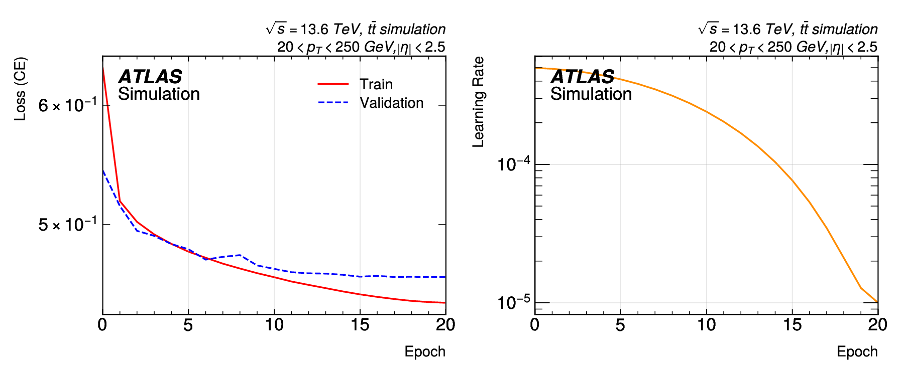
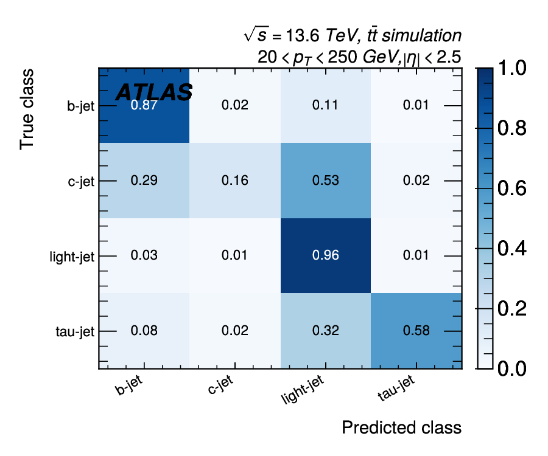
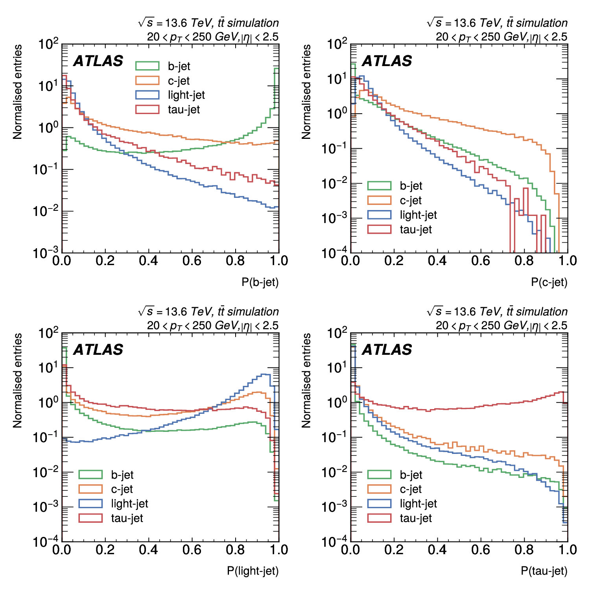
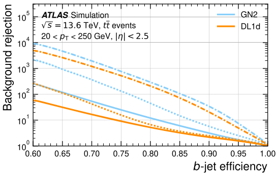
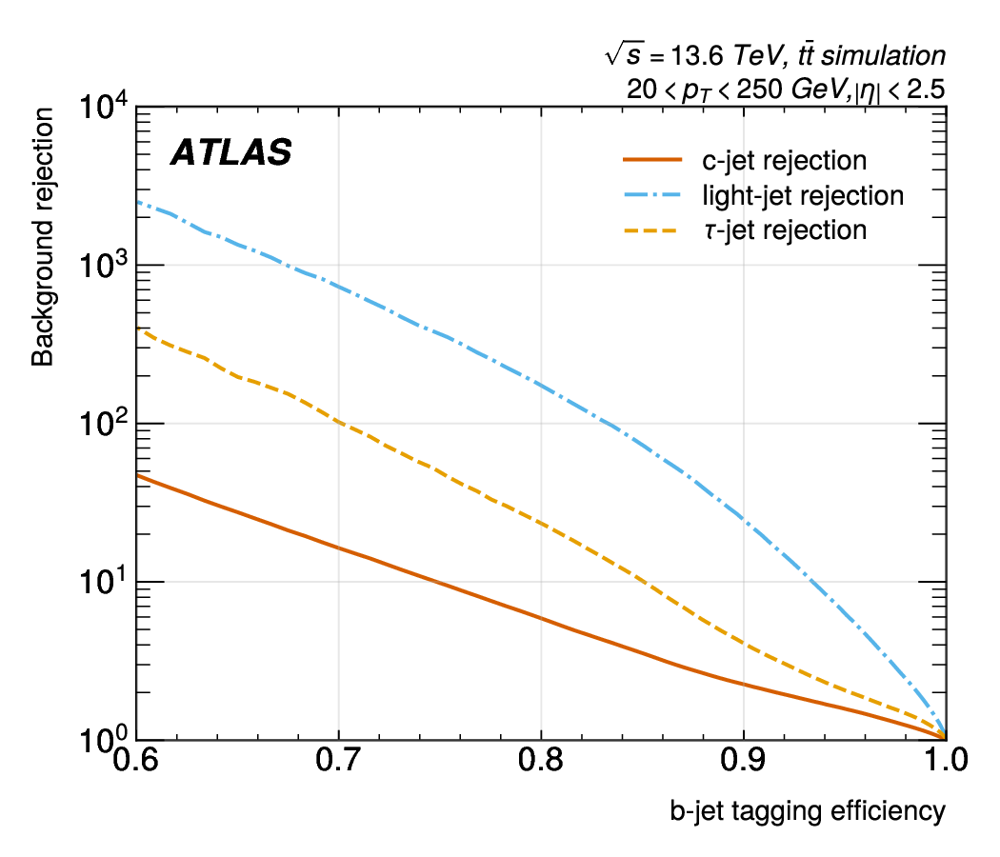
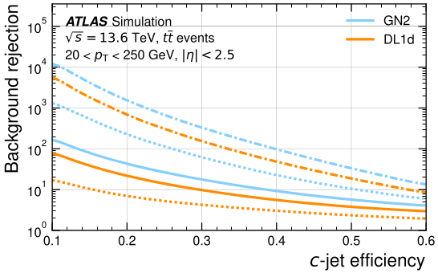
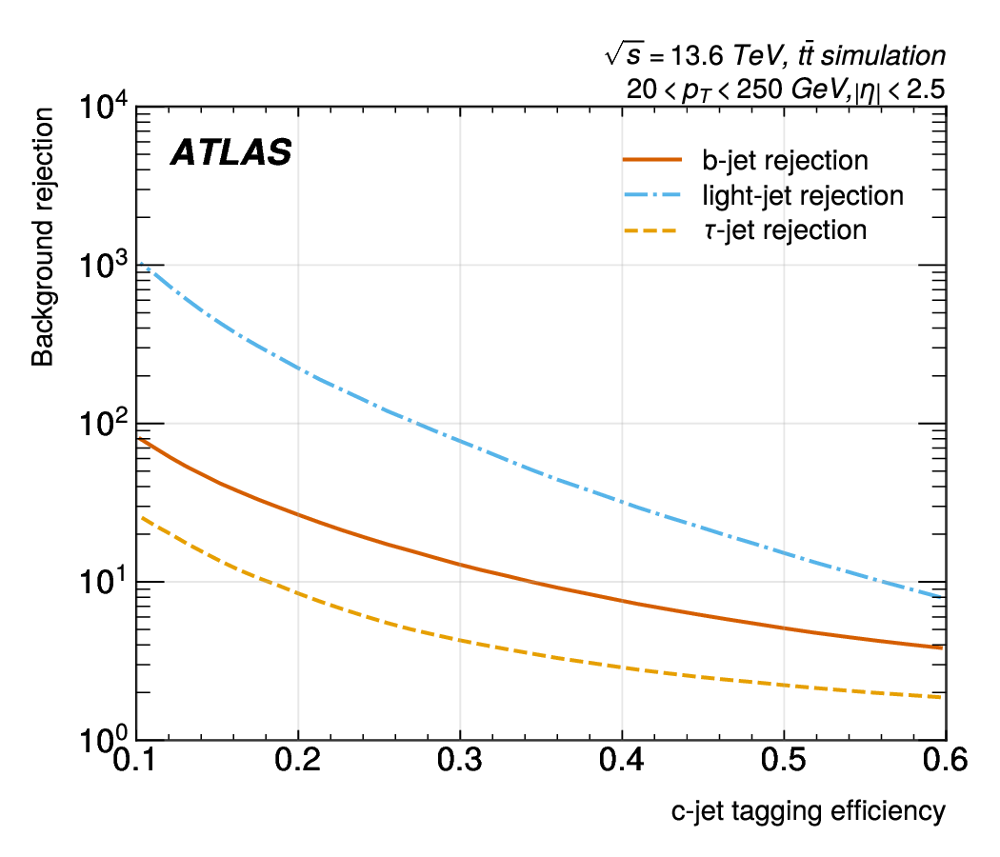

# GN2 Jet Flavour Tagger


[](https://github.com/lucanasini/CMEPDA_project_transformer_jet_tagging/actions/workflows/ci.yml)
[](https://github.com/lucanasini/CMEPDA_project_transformer_jet_tagging/actions/workflows/docs.yml)
[](https://lucanasini.github.io/CMEPDA_project_transformer_jet_tagging/)


Implementation of the GN2 tagger described in:
> *"Transforming jet flavour tagging at ATLAS"*, Nature Communications (2026) 17:541

Simplified version with only the **jet flavor classification head**
(without the auxiliary objectives of track origin and vertex grouping).

---

## Project Structure

```
CMEPDA_project_transformer_jet_tagging/
├── main.py                         ← entry point
├── configs/
│   └── config.json                 ← all hyperparams and settings
├── dataset/                        ← put here the .h5 file
├── src/transformer_jet_tagging/
│   ├── __init__.py                 ← package init
│   ├── _version.py                 ← package version
│   ├── constants.py                ← feature names, class mapping
│   ├── dataset.py                  ← dataset and data loading
│   ├── model.py                    ← GN2 architecture (transformer) and D_b, D_c discriminant
│   ├── train.py                    ← GN2 loss, learning rate scheduler and training loop
│   ├── evaluate.py                 ← valutazione, plot
│   ├── plotting.py                 ← plotting functions (variables distributions and correlations, learning curves)
│   └── utils.py                    ← utility functions
├── tests/                          ← unit tests
│   ├── conftest.py
│   ├── test_dataset.py
│   ├── test_model.py
│   ├── test_train.py
│   └── test_utils.py
└── outputs/
    ├── checkpoints/
    │   ├── runs/
    │   │    └── <timestamp>/
    │   │         ├── best_model.pt
    │   │         └── learning_curves.pdf
    │   └── best_model/
    │       ├── best_model.pt
    │       └── learning_curves.pdf
    ├── eval/
    │   ├── metrics.json
    │   ├── confusion_matrix.pdf
    │   ├── score_distributions.pdf      ← softmax P(class) per true-label class
    │   ├── discriminant_db.pdf          ← D_b distribution per flavour
    │   ├── discriminant_dc.pdf          ← D_c distribution per flavour
    │   ├── roc_db.pdf                   ← b-tag ROC
    │   └── roc_dc.pdf                   ← c-tag ROC
    ├── data_statistics/
    │   ├── correlation_jet.pdf          ← correlation matrix of jet features
    │   ├── correlation_track.pdf        ← correlation matrix of track features
    │   ├── jet_variables.pdf            ← distribution of jet features
    │   ├── label_distribution.pdf       ← distribution of the target classes
    │   └── track_variables_page*.pdf    ← distribution of track features (one page per feature)
    └── preprocess/
        ├── indices/
        │   ├── test_indices.npy
        │   ├── train_indices.npy
        │   └── val_indices.npy
        └── norm_stats.json
```

---

## Requirements

Python 3.13+ with:

```
torch>=2.7.1
numpy>=2.4.0
h5py>=3.16.0
scikit-learn>=1.8.0
matplotlib>=3.10.8
mplhep>=1.1.2
```

---

## Installation

### 1. Make a virtual environment (reccomended)

```bash
python3 -m venv venv
source venv/bin/activate          # Linux/macOS
# or: venv\Scripts\activate       # Windows
```

### 2. Install dependencies

**With GPU (CUDA 11.8):**
```bash
pip install torch --index-url https://download.pytorch.org/whl/cu118
pip install .
```

**With GPU (CUDA 12.1):**
```bash
pip install torch --index-url https://download.pytorch.org/whl/cu121
pip install .
```

**Only CPU (slow):**
```bash
pip install torch --index-url https://download.pytorch.org/whl/cpu
pip install .
```

### 3. Put the HDF5 file in `dataset/` folder

```bash
cp /path/to/your/file.h5 dataset/file_name.h5
```

The expected structure of the HDF5 file is:
```
/jets          - variables jet-level (structured array)
/tracks        - variables track-level (structured array)
/eventwise     - variables events
/truth_hadrons - info truth hadron
```

Update the file name in
`configs/config.json`.

---

## Usage:
Install the package:
```bash
pip install -e .
```
Then run:
```bash
python -m transformer_jet_tagging [OPTIONS]
```

### Options:
```
-h, --help           Show help message and exit
--version            Show version
--config CONFIG      Path to the JSON config file (default: `outputs/checkpoints/`)
--evaluate           Run evaluation on the test set instead of training
--debug-frac FLOAT   Fraction of data to use (default: 1.0)
```

---

## Configuration

All hyperparameters and settings are in `configs/config.json`. You can edit it directly or pass a different config file with `--config`.

---

## Outputs
The trained model and training logs will be saved in the directory specified in `config["output"]["checkpoints_dir"]` (default: `outputs/checkpoints/`), while the evaluation results and plots will be saved in `config["output"]["eval_dir"]` (default: `outputs/eval/`):

```
outputs/checkpoints/
├── runs/                                ← logs for each run
│    └── <timestamp>/                    ← date and time of the run
│        ├── best_model.pt               ← best model of the run
│        └── learning_curves.pdf
├── best_model/                          ← best model across all runs
│   ├── best_model.pt
│   └── learning_curves.pdf
└── eval/
    ├── metrics.json
    ├── confusion_matrix.pdf
    ├── score_distributions.pdf          ← softmax P(class) per true-label class
    ├── discriminant_db.pdf              ← D_b distribution per flavour
    ├── discriminant_dc.pdf              ← D_c distribution per flavour
    ├── roc_db.pdf                       ← b-tag ROC
    └── roc_dc.pdf                       ← c-tag ROC
```

---

## Features and Target

### Input features
- Jet features (2):
  - `jet_pt`: transverse momentum of the jet
  - `jet_eta`: pseudorapidity of the jet
- Track features (19):
  - `qOverP`: charge over momentum
  - `deta`: difference in pseudorapidity between the track and the jet
  - `dphi`: difference in azimuthal angle between the track and the jet
  - `d0`: transverse impact parameter
  - `z0SinTheta`: longitudinal impact parameter times sin(theta)
  - `qOverPUncertainty`: uncertainty on qOverP
  - `thetaUncertainty`: uncertainty on theta
  - `phiUncertainty`: uncertainty on phi
  - `lifetimeSignedD0Significance`: signed transverse impact parameter significance
  - `lifetimeSignedZ0SinThetaSignificance`: signed longitudinal impact parameter significance
  - `numberOfPixelHits`: number of pixel hits
  - `numberOfSCTHits`: number of SCT hits
  - `numberOfInnermostPixelLayerHits`: number of hits in the innermost pixel layer
  - `numberOfNextToInnermostPixelLayerHits`: number of hits in the next-to-innermost pixel layer
  - `numberOfInnermostPixelLayerSharedHits`: number of shared hits in the innermost pixel layer
  - `numberOfInnermostPixelLayerSplitHits`: number of split hits in the innermost pixel layer
  - `numberOfPixelSharedHits`: number of shared hits in the pixel detector
  - `numberOfPixelSplitHits`: number of split hits in the pixel detector
  - `numberOfSCTSharedHits`: number of shared hits in the SCT detector

### Target
- `HadronConeExclTruthLabelID`: PDG ID → class
  - 5 → 0 (b-jet)
  - 4 → 1 (c-jet)
  - 0 → 2 (light-jet)
  - 15 → 3 (τ-jet)

---

## Architecture

```
For each jet (B = batch size):

  [jet_pt, jet_eta]               (2 feature)
  [40 tracks × 19 feature]        + boolean mask
        │
        ▼
  Concanate jet features to each tracks (B, 40, 21)
        │
        ▼
  Track Initialiser MLP: 21 → 256 → 256
        │
        ▼
  Transformer Encoder × 4 layer
  (8 heads, embed=256, ffn=512, preLayerNorm)
        │
        ▼
  Projection: 256 → 128
        │
        ▼
  Attention Pooling → (B, 128)   [jet representation]
        │
        ▼
  Classification Head: 128 → 128 → 64 → 32 → 4
        │
        ▼
  Softmax → [pb, pc, pu, pτ]
        │
        ▼
  D_b = log[ pb / (0.2 pc + 0.05 pτ + 0.75 pu) ]
  D_c = log[ pb / (0.3 pb + 0.01 pτ + 0.69 pu) ]
```

## Results

Evaluated on the MC $t\bar{t}$ test set at $\sqrt{s} = 13.6$ TeV,
jets with $20 < p_T < 250$ GeV and $|\eta| < 2.5$.

### Training

<p align="center">
    <figure>
        
        <figcaption>
        <em>Training and validation loss curves with the learning rate schedule.</em>
        </figcaption>
    </figure>
</p>

### Classification metrics

| Class     | Precision | Recall | F1-score |
|-----------|-----------|--------|----------|
| b-jet     | 0.88      | 0.86   | 0.88     |
| c-jet     | 0.54      | 0.16   | 0.24     |
| light-jet | 0.83      | 0.96   | 0.89     |
| τ-jet     | 0.69      | 0.58   | 0.63     |

**Overall accuracy: 0.84**

### Confusion matrix and score distributions

<p align="center">
    <figure>
        
        
        <em>Left: normalized confusion matrix on the test set.
        Right: softmax score distributions P(class) separated by true jet flavour.</em>
        </figcaption>
    </figure>
</p>

### ROC curves

<p align="center">
    <figure>
        
        
        <figcaption>
        <em>Left: ATLAS ROC for $b$-tagging.
        Right: this implementation for $b$-tagging.</em>
        </figcaption>
    </figure>
</p>

<p align="center">
    <figure>
        
        
        <figcaption>
        <em>Left: ATLAS ROC for $c$-tagging.
        Right: this implementation for $c$-tagging.</em>
        </figcaption>
    </figure>
</p>

### Background rejection at working points

**b-tagging at 70% efficiency:**

| Background | GN2 (ATLAS) | This implementation |
|------------|-------------|---------------------|
| c-jet      | 50          | 12                  |
| light-jet  | 2000        | 700                 |
| $\tau$-jet | 400         | 100                 |

**c-tagging at 30% efficiency:**

| Background | GN2 (ATLAS) | This implementation |
|------------|-------------|---------------------|
| b-jet      | 20          | 12                  |
| light-jet  | 300         | 70                  |
| $\tau$-jet | 60          | 4                   |

Quantitative performance is lower than GN2 by a factor $~3-4$ for $b$-tagging
and $~5-10$ for $c$-tagging, consistent with the reduced model size ($~230$ k vs
millions of parameters), smaller training dataset, and absence of auxiliary
training objectives.